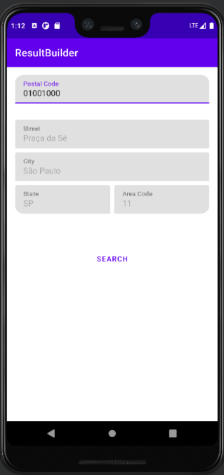

# result-builder
## Simplify asynchronous execution with Coroutines using a Builder pattern inspired by Flow operators.

The article provides a clear overview of the use of a builder pattern to manage async calls in a clean architecture Android project. It also discusses the benefits of using the builder pattern and how it can improve the readability and maintainability of code, as well as the potential risks of using a long-lived scope when launching coroutines.

##  See more about this project on [Medium](https://medium.com/@costa.fbo/exploring-the-use-of-a-builder-pattern-for-managing-async-calls-in-a-clean-architecture-android-a4512c24bdc6)

## How to use this [ResultBuilder](https://github.com/F4bioo/result-builder/blob/5cb52ba3b0dba436faf3dc91b93c530003043c14/app/src/main/java/com/fappslab/resultbuilder/arch/resultbuilder/ResultBuilder.kt)?

```plaintext
class MainViewModel(
    private val getAddressUseCase: GetAddressUseCase,
) : ViewModel() {

    ...

    fun getAddress(code: String) {
        runAsyncSafely {
            getAddressUseCase(code)
        }.onStart {
            _state.update { it.copy(shouldShowLoading = true) }
        }.onCompletion {
            _state.update { it.copy(shouldShowLoading = false) }
        }.onFailure { cause ->
            getAddressFailure(cause)
        }.onSuccess { address ->
            getAddressSuccess(address)
        }.launchIn(viewModelScope)
    }

    ...
}
```

## In the project you can see more details about this class and all implementation and tests.

# result-builder
## Simplify asynchronous execution with Coroutines using a Builder pattern inspired by Flow operators.

The article provides a clear overview of the use of a builder pattern to manage async calls in a clean architecture Android project. It also discusses the benefits of using the builder pattern and how it can improve the readability and maintainability of code, as well as the potential risks of using a long-lived scope when launching coroutines.

##  See more about this project on [Medium](https://medium.com/@costa.fbo/exploring-the-use-of-a-builder-pattern-for-managing-async-calls-in-a-clean-architecture-android-a4512c24bdc6)

## How to use this [ResultBuilder](https://github.com/F4bioo/result-builder/blob/5cb52ba3b0dba436faf3dc91b93c530003043c14/app/src/main/java/com/fappslab/resultbuilder/arch/resultbuilder/ResultBuilder.kt)?

```plaintext
class MainViewModel(
    private val getAddressUseCase: GetAddressUseCase,
) : ViewModel() {

    ...

    fun getAddress(code: String) {
        runAsyncSafely {
            getAddressUseCase(code)
        }.onStart {
            _state.update { it.copy(shouldShowLoading = true) }
        }.onCompletion {
            _state.update { it.copy(shouldShowLoading = false) }
        }.onFailure { cause ->
            getAddressFailure(cause)
        }.onSuccess { address ->
            getAddressSuccess(address)
        }.launchIn(viewModelScope)
    }

    ...
}
```

## In the project you can see more details about this class and all implementation and tests.



